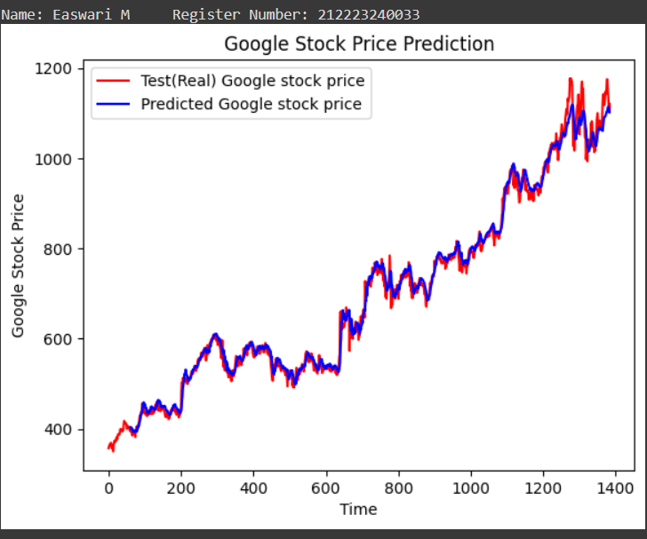

# Stock Price Prediction

## AIM

To develop a Recurrent Neural Network model for stock price prediction.

## Problem Statement and Dataset


## Design Steps

### Step 1:

Load and preprocess dataset

### Step 2:

Initialize a Sequential model and add SimpleRNN and Dense layers.

### Step 3:

Compile and fit the model 

### Step 4:
Train the model with training data.

### Step 5:

Predict the results using the trained model and plot the results

## Program
#### Name: Easwari M
#### Register Number: 212223240033

```
import numpy as np
import matplotlib.pyplot as plt
import pandas as pd
from sklearn.preprocessing import MinMaxScaler
from keras import layers
from keras.models import Sequential

dataset_train = pd.read_csv('trainset.csv')
dataset_train.columns
dataset_train.head()
train_set = dataset_train.iloc[:,1:2].values
type(train_set)
train_set.shape

sc = MinMaxScaler(feature_range=(0,1))
training_set_scaled = sc.fit_transform(train_set)
training_set_scaled.shape
X_train_array = []
y_train_array = []
for i in range(60, 1259):
  X_train_array.append(training_set_scaled[i-60:i,0])
  y_train_array.append(training_set_scaled[i,0])
X_train, y_train = np.array(X_train_array), np.array(y_train_array)
X_train1 = X_train.reshape((X_train.shape[0], X_train.shape[1],1))

X_train.shape
length = 60
n_features = 1

stock = Sequential()
s1=layers.SimpleRNN(45,input_shape=(length, n_features))
stock.add(s1)
s3=layers.Dense(30,activation='relu')
stock.add(s3)
s4=layers.Dense(1)
stock.add(s4)

stock.compile(optimizer='adam', loss='mse')


print("Name:Easwari M   Register Number: 212223240033        ")
stock.summary()
stock.fit(X_train1,y_train,epochs=10, batch_size=32)
dataset_test = pd.read_csv('testset.csv')
test_set = dataset_test.iloc[:,1:2].values
test_set.shape
dataset_total = pd.concat((dataset_train['Open'],dataset_test['Open']),axis=0)

inputs = dataset_total.values
inputs = inputs.reshape(-1,1)
inputs_scaled=sc.transform(inputs)
X_test = []
for i in range(60,1384):
  X_test.append(inputs_scaled[i-60:i,0])
X_test = np.array(X_test)
X_test = np.reshape(X_test,(X_test.shape[0], X_test.shape[1],1))

X_test.shape
predicted_stock_price_scaled = stock.predict(X_test)
predicted_stock_price = sc.inverse_transform(predicted_stock_price_scaled)
print("Name: Easwari M     Register Number: 212223240033 ")
plt.plot(np.arange(0,1384),inputs, color='red', label = 'Test(Real) Google stock price')
plt.plot(np.arange(60,1384),predicted_stock_price, color='blue', label = 'Predicted Google stock price')
plt.title('Google Stock Price Prediction')
plt.xlabel('Time')
plt.ylabel('Google Stock Price')
plt.legend()
plt.show()

```

## Output

### True Stock Price, Predicted Stock Price vs time



### Mean Square Error


## Result

A model for predicting stock price using RNN network is successfully created.